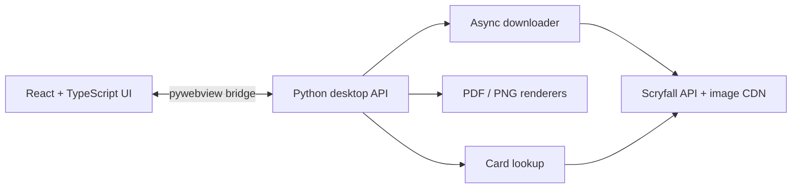

<p align="center">
  
</p>

<h1 align="center">ProxyToolBox</h1>

<p align="center">
  A Windows desktop app for downloading Magic: The Gathering card images,<br>
  arranging print-ready proxy sheets, and finding exact card printings.
</p>

<p align="center">
  <a href="https://github.com/Katzukum/Scryfall-Proxy-Grabber/releases/latest"></a>
  
  
  
</p>

ProxyToolBox turns an exported deck list into an organized folder of high-resolution card images, then lays those images out as PDF or PNG sheets with configurable card dimensions, spacing, and rounded corners. Double-faced cards and tokens can be paired for two-sided printing, while the built-in lookup makes it easy to find and download a specific printing.

## Download

Download the current Windows executable from the **[latest GitHub release](https://github.com/Katzukum/Scryfall-Proxy-Grabber/releases/latest)**.

The packaged `.exe` is portable: place it in the folder where you want to work and launch it. ProxyToolBox creates order folders and print output relative to the location from which the application is run.

## Features

### Card downloader

- Imports Moxfield-style deck lists with quantities, set codes, and collector numbers.
- Uses Scryfall's collection API to resolve exact printings in batches.
- Downloads large card images and creates requested duplicate copies locally.
- Optionally discovers and downloads related tokens.
- Keeps multi-face cards organized in a dedicated `transformers` folder.
- Produces a consolidated error report and includes an in-app resolution workflow.

### Print setup

- Exports either PDF documents or high-resolution PNG sheets.
- Uses an 8-card, landscape US Letter layout with cutting guides.
- Supports configurable width, height, corner radius, and card spacing.
- Generates single-sided sheets or paired front/back transformer layouts.
- Moves a completed download directly into the print workflow.

### Card lookup

- Searches cards by name and displays available printings.
- Looks up an exact card by set code and collector number.
- Shows card imagery and raw Scryfall data.
- Downloads an individual printing directly from its detail view.

### Desktop experience

- Modern React interface hosted in a native pywebview window.
- Background downloads and rendering keep the interface responsive.
- Persistent progress reporting and a collapsible activity log.
- Shared, application-specific Scryfall HTTP configuration and polite request pacing.

## Quick start

### 1. Prepare a deck list

ProxyToolBox accepts one card per line in this format:

```text
1 Sol Ring (C14) 55
4 Lightning Bolt (M11) 149
1 Venser, the Sojourner (SOM) 135
```

Each line must contain:

```text
quantity card name (SET) collector-number
```

Blank lines and a `Sideboard` heading are ignored. Common trailing foil markers or symbols are also stripped during parsing.

### 2. Download cards

1. Open **Download Cards**.
2. Choose an order/folder name.
3. Paste the deck list.
4. Enable **Include Tokens** or **Dual Face Token** when needed.
5. Select **Start Download**.

The downloaded images are saved in the order folder. Multi-face cards are placed under `<order>/transformers`.

### 3. Create print sheets

1. Open **Print Setup**. A completed order is selected automatically.
2. Confirm the image folder and card dimensions.
3. Choose PDF or PNG output.
4. Enable **Two-Sided (Transformers)** for paired front/back sheets.
5. Select **Create Document**.

Generated files are written into the selected image folder.

## Development

### Prerequisites

- Windows 10 or newer
- Python 3.11+
- Node.js and npm
- Git

### Install from source

```powershell
git clone https://github.com/Katzukum/Scryfall-Proxy-Grabber.git
Set-Location Scryfall-Proxy-Grabber

py -3.11 -m venv .venv
.\.venv\Scripts\Activate.ps1
python -m pip install --upgrade pip
python -m pip install -e ".[dev]"

Set-Location frontend
npm install
npm run build
Set-Location ..

python main.py
```

### Run in development mode

Start Vite in one terminal:

```powershell
Set-Location frontend
npm run dev
```

Then start the desktop shell from the project root in another terminal:

```powershell
.\.venv\Scripts\Activate.ps1
python main.py --dev
```

### Run tests

```powershell
.\.venv\Scripts\python.exe -m pytest
```

### Build a Windows release

```powershell
.\build_release.bat
```

The builder prompts for a version, compiles the frontend, packages the app with PyInstaller, and writes `ProxyToolBox-v<version>.exe` to `release/`.

## Architecture



| Layer | Technology | Responsibility |
| --- | --- | --- |
| Desktop shell | Python, pywebview | Native window, file dialogs, frontend/backend bridge |
| Frontend | React, TypeScript, Vite, Tailwind CSS | User interface, state, logs, and progress |
| Downloader | `httpx`, `asyncio`, Pydantic | Deck parsing, Scryfall requests, image organization |
| Print engine | ReportLab, Pillow | PDF and PNG layout, cutting grids, two-sided output |
| Packaging | PyInstaller | Portable Windows executable |

## Project structure

```text
ProxyToolBox/
├── assets/                 Windows application icon
├── docs/                   Extended project documentation
├── frontend/               React and TypeScript interface
│   ├── public/             Branding and static assets
│   └── src/                Tabs, components, hooks, and bridge types
├── src/
│   ├── card_lookup/        Scryfall search and printing lookup
│   ├── downloader/         Deck parser and image downloader
│   ├── print_setup/        PDF and PNG renderers
│   ├── api.py              Native API exposed to the frontend
│   └── scryfall_http.py    Shared Scryfall client configuration
├── tests/                  Python regression tests
├── build_release.bat       Windows release builder
├── main.py                 Desktop application entry point
└── proxytoolbox.spec       PyInstaller configuration
```

## Contributing

Issues and focused pull requests are welcome. For code changes:

1. Fork the repository and create a feature branch.
2. Keep frontend and backend responsibilities separated by the pywebview API boundary.
3. Add or update tests for behavior changes.
4. Run the Python test suite and the frontend production build before opening a pull request.

Use the **[issue tracker](https://github.com/Katzukum/Scryfall-Proxy-Grabber/issues)** for reproducible bugs and feature proposals.

## Data sources and disclaimer

Card metadata and imagery are provided by **[Scryfall](https://scryfall.com/)**. ProxyToolBox is an independent, fan-made utility and is not affiliated with or endorsed by Scryfall, Wizards of the Coast, or Hasbro.

Magic: The Gathering and its associated marks are property of Wizards of the Coast. Users are responsible for following applicable laws, platform policies, and tournament rules when creating or using proxies.
